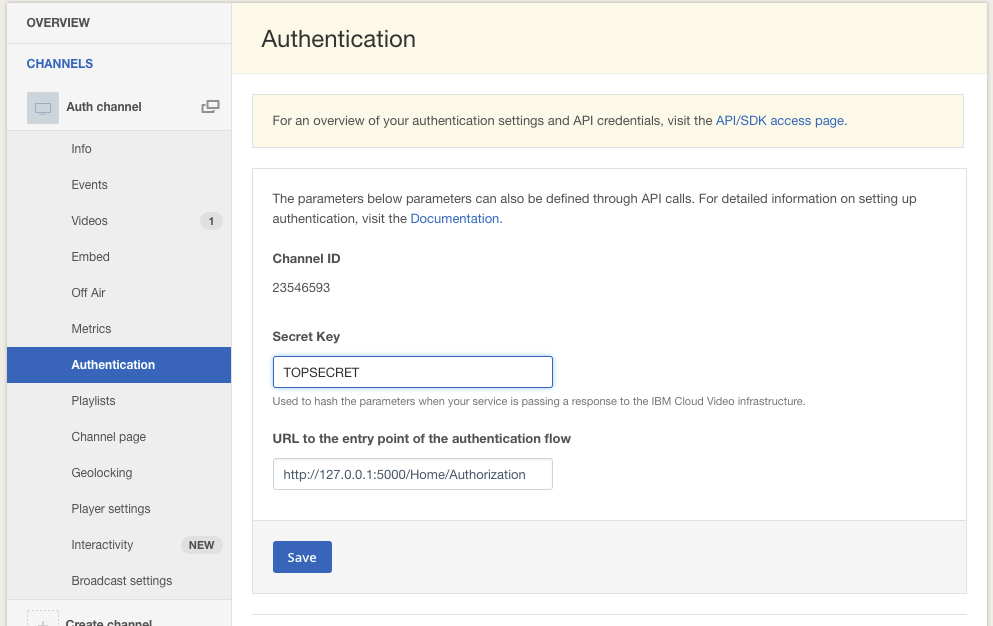
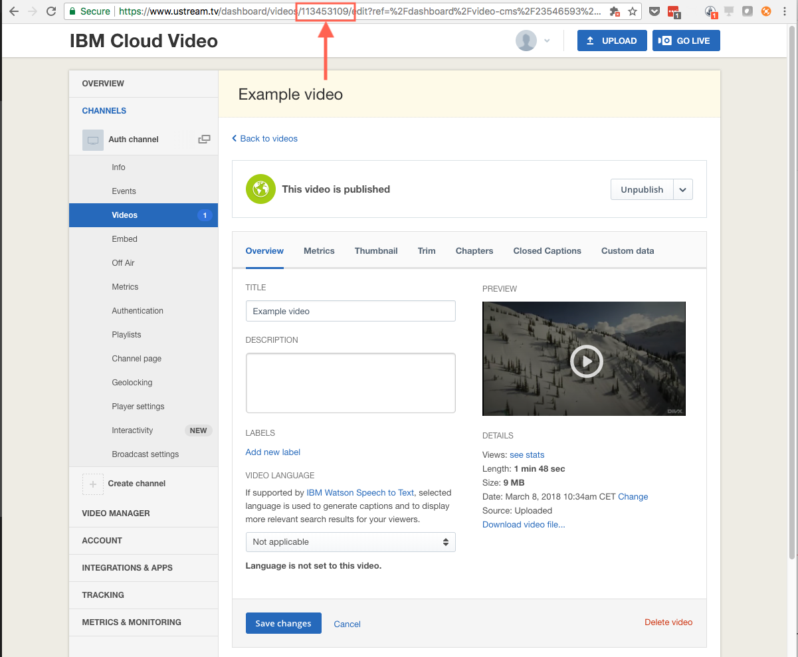

# IBM Cloud Video Viewer Authentication Setup Demo

## Requirments
* An [IBM Cloud Video Streaming Manager for Enterprise with Authentication API account](https://www.ustream.tv/product/align-secure-streaming-video) *(You can request a Trial account [here](https://www.ustream.tv/enterprise-video/contact-internal-communications))*
* Install [.NET Core SDK](https://www.microsoft.com/net/download)

## Installion
1. **Set up channel authentication** for your channel(s) on Channels/Authentication dashboard
   * Secret Key: **Some random string**, this secret key is used for signing and validating authorization data
   * URL for the entry point of the authentication flow: **http://127.0.0.1:5000/Home/Authorization** This is the end point where you can authorize your users to the content and then generate the signed hash data.
   
2. **Set Secret Key** in [HomeController.cs](Controllers/HomeController.cs)
```
    ...
        private const string hashSecret = "TOPSECRET";
    ...
```
3. **Set a video id** in [HomeController.cs](Controllers/HomeController.cs) which will be used in this example. (This video need to be under the same channel which was set up in Step 2.)
```
    ...
        private const int videoId = 1111;
    ...
```


4. **Run demo** on localhost
```
ASPNETCORE_ENVIRONMENT=Development dotnet run
```

5. **Open demo** in your bowser: http://127.0.0.1:5000/ (Recommended to use incognito mode)

## Hint
* Check how authentication/autherization works in [`HahslockDemo.Controllers.HomeController::Authorization`](Controllers/HomeController.cs)
* Check how hash data generation works in [`Ustream.Hash`](Ustream/Hash.cs)

# Resources
[IBM Cloud Video Viewer Authentication API](http://developers.ustream.tv/channel-api/viewer-authentication-api.html)
